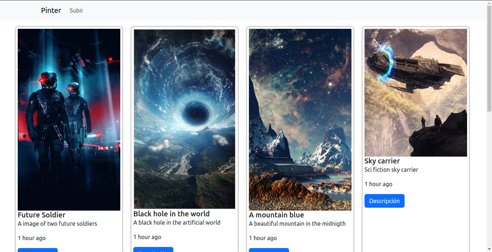
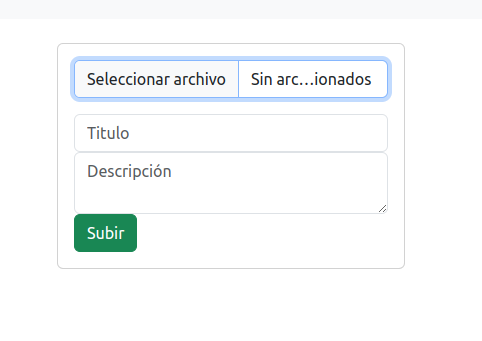
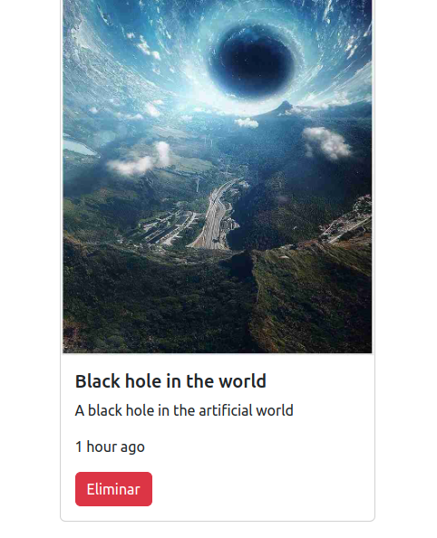
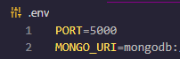

## App Pinterest Style

<div align="center">



</div>

### Descripción
Una app al estilo de la aplicación pinterest, hecha con Nodejs y Express, usando el template engine Handlebars, MongoDB para guardar los datos de las imagenes y usando el paquete npm "multer" para subir las imagenes al servidor.

<div align="center">


</div>

### Instrucciones de uso

1.- Da click en el boton "subir" de la barra de navegación y sube la imagen que gustes.

<div align="center">



</div>

2.- Para borrar una imagen que ya subiste solo da click en el boton descripción y luego en eliminar.

<div align="center">



</div>

### Instrucciones de instalación
Si quieres correr el proyecto en tu computadora sigue los pasos siguientes:

- Ejecutar el comando para instalar las dependencias:

```
 $ npm install
```

- Crear un archivo .env en la raiz del proyecto y agregar las variables PORT y MONGO_URI

<div align = "center"> 



</div>

- Ejecutar babel para crear codigo de producción

```
 $ npm run build
```

- Ejecutar el Proyecto


```
 $ npm run start
```